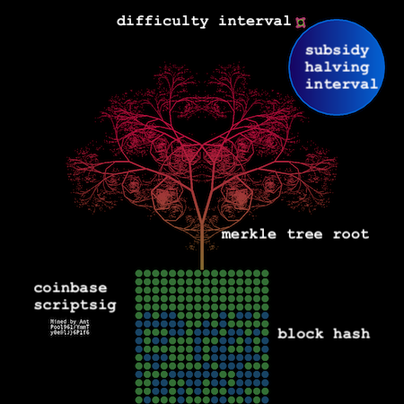

# blockstr

Block Art Transmitted by Relays

Follow on nostr!

```
npub18l0cks7jum44nlpena7trwqey0galuppt4z6z8surunesfl24tvqr04ml9
```

# The art

All the details of the image are derived from data in each block.

The hash of the block is represented in binary in the middle of the image. The colors of the `1` and `0` bits are determined by the last 6 bytes
of the block hash itself, providing two RGB values.

The "tree" fractal above the block hash is derived from the merkle tree root hash in the block header. Again two sets of colors for the gradient
are determined by the last 6 bytes of the hash. The first byte of the hash determines the "angle" of the fractal in tree pattern.

The phase of the moon represents the susidy halving interval. The moon fills up every 210,000 blocks then starts over. It's color is determined by
the `nBits` value (the difficulty target) in the block header.

The little satellite orbits the moon every 2,016 blocks representing the difficulty adjustment interval on the blockchain. Its colors are derived
from the `nonce` field in the block header.

Finally, the coinbase scriptsig is printed in the lower left side of the image. This is text added to the block by the miner or mining pool.


